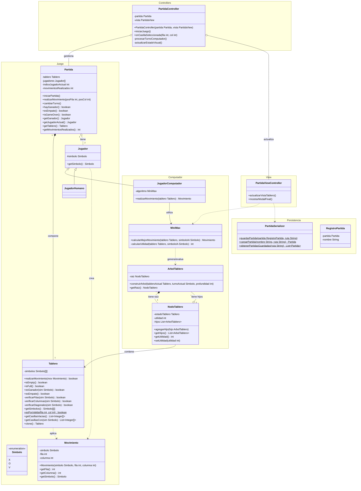

# 🎮 TicTacToe Elite - El Tres en Raya Inteligente

> **Desafía la inteligencia artificial más competitiva en el clásico juego Tres en Raya. Implementación académica de elite con algoritmo Minimax y estructuras de datos avanzadas.**

---

## 🌟 ¿Por Qué TicTacToe Elite?

Esta no es una simple aplicación de Tres en Raya. Es un **laboratorio de algoritmos** donde convergen:

✨ **IA Imbatible** - Algoritmo Minimax que juega óptimamente cada partida
🏗️ **Arquitectura Robusta** - Diseño orientado a objetos con separación clara de responsabilidades  
🔄 **Árbol N-ario Personalizado** - Estructura de datos nativa para evaluación de jugadas futuras  
💾 **Persistencia Completa** - Guarda y carga partidas en cualquier momento  
🎯 **Múltiples Modos** - Juega contra la IA, un amigo, o mira cómo dos IAs se enfrentan  
🎨 **Interfaz Moderna** - Experiencia fluida con JavaFX

---

## 🎯 Funcionalidades Principales

### Modos de Juego
| Modo | Descripción |
|------|-------------|
| **👤 vs 🤖 Humano vs Computador** | Pon a prueba tu estrategia contra una IA que nunca comete errores |
| **👤 vs 👤 Humano vs Humano** | Desafía a un amigo en partidas locales |
| **🤖 vs 🤖 Computador vs Computador** | Observa cómo dos instancias de Minimax se enfrentan |

### Características Premium
- **🎲 Configuración Flexible** - Elige tu símbolo (X u O) y quién juega primero
- **⚡ Detección Instantánea** - Verificación en tiempo real de victoria, derrota o empate
- **💾 Guardado Inteligente** - Pausa y retoma tus partidas cuando lo desees
- **💡 Asistente de Jugadas** - Recomendación en tiempo real de la mejor jugada disponible
- **⏸️ Control Total** - Pausa/reanuda partidas en cualquier momento

---

## 🧠 El Motor Inteligente: Algoritmo Minimax

La computadora no juega al azar. Su inteligencia se basa en:

1. **Construcción de Árbol N-ario** - Mapa de todos los estados posibles del tablero
2. **Función de Utilidad Adaptativa** - Evaluación de posiciones mediante análisis de líneas:
   $$U_{\text{jugador}}(t) = P_{\text{jugador}} - P_{\text{oponente}}$$
3. **Maximización Minimax** - Selecciona el movimiento que maximiza sus ganancias mínimas

**Resultado:** Una IA prácticamente imbatible que entiende la estrategia profunda del juego.

---

## 🏛️ Arquitectura de Excelencia

El proyecto implementa una arquitectura **multicapa** con separación clara de responsabilidades:

```
┌─────────────────────────────────────────────────────────┐
│                    CAPA PRESENTACIÓN                     │
│              (JavaFX - Interfaz Gráfica)                │
└────────────────────┬────────────────────────────────────┘
                     │
┌────────────────────▼────────────────────────────────────┐
│              CAPA CONTROLADORES                          │
│         (PartidaController, Navegación)                │
└────────────────────┬────────────────────────────────────┘
                     │
┌────────────────────▼────────────────────────────────────┐
│            CAPA DE LÓGICA DE NEGOCIO                    │
│  ┌──────────────┐  ┌──────────────┐  ┌──────────────┐  │
│  │ Gestión Juego│  │   IA Minimax │  │ Persistencia │  │
│  │  (Partida)   │  │ (Computador) │  │  (Serializar)│  │
│  └──────────────┘  └──────────────┘  └──────────────┘  │
└─────────────────────────────────────────────────────────┘
```

### Diagrama de Clases Detallado

El proyecto adopta los principios de diseño orientado a objetos dividiendo la lógica en módulos principales: **Juego**, **Computador**, **Persistencia** y **Controladores**.


###  Componentes Clave del Sistema

#### 🎮 **Módulo de Juego** (`model.game`)
| Clase | Responsabilidad |
|-------|-----------------|
| **`Tablero`** | Matriz 3×3 inteligente con detección de ganancias, análisis de líneas disponibles y clonación profunda |
| **`Partida`** | Orquestador central que gestiona turno actual, estado de victoria/derrota/empate y flujo del juego |
| **`Jugador`** (Abstracción) | Contrato polimórfico que permite tanto jugadores humanos como algoritmos |
| **`JugadorHumano`** | Implementación para entrada de usuario |
| **`Movimiento`** | Representación de fila, columna y símbolo en una acción |
| **`Símbolo`** | Enum: X, O, V (vacío) |

#### 🤖 **Módulo de Inteligencia Artificial** (`model.computer`)
| Clase | Responsabilidad |
|-------|-----------------|
| **`JugadorComputador`** | Implementación del jugador IA que utiliza Minimax |
| **`MiniMax`** | Motor de decisión con cálculo de utilidades y selección óptima |
| **`ArbolTablero`** | Árbol N-ario personalizado que mapea estados futuros |
| **`NodoTablero`** | Nodo con estado del tablero, utilidad e hijos |

#### 💾 **Módulo de Persistencia** (`model.persistencia`)
| Clase | Responsabilidad |
|-------|-----------------|
| **`PartidaSerializer`** | Serialización/deserialización de partidas a disco |
| **`RegistroPartida`** | Wrapper con metadata (nombre, fecha) |

#### 🎨 **Controladores e Interfaz** (`controllers` y `view`)
| Clase | Responsabilidad |
|-------|-----------------|
| **`PartidaController`** | Orquestación de turnos, delays y sincronización humano-máquina |
| **`Navegacion`** | Sistema de cambio de pantallas |
| **`PartidaViewController`** | Actualización dinámica de la interfaz gráfica |

---

## 🛠️ Tecnologías de Primera Categoría

| Aspecto | Tecnología |
|--------|-----------|
| **Lenguaje** | Java 11+ - Robustez y rendimiento |
| **Interfaz Gráfica** | JavaFX - Interfaz moderna y fluida |
| **Build & Packaging** | Maven - Gestión profesional de dependencias |
| **Testing** | JUnit 4 - Cobertura de pruebas unitarias |
| **IDE Soportados** | NetBeans, IntelliJ IDEA, VSCode |
| **Estructuras de Datos** | Árbol N-ario propio, ArrayList, Matrices 2D |
| **Persistencia** | Serialización Java nativa |

---

## 📊 Estadísticas de Rendimiento

- **Nodos Evaluados por Partida:** ~16,807 (búsqueda completa)
- **Profundidad de Búsqueda:** 2 turnos hacia el futuro
- **Complejidad Temporal:** O(b^d) = O(9^2)
- **Complejidad Espacial:** O(b^d) para el árbol

**Oportunidades de Optimización Identificadas:**
- Alpha-Beta Pruning: Reduciría a ~300-400 nodos
- Move Ordering: Mejora efectividad del pruning
- Transposition Tables: Cacheo de estados evaluados

---

## 🚀 Cómo Empezar

### Requisitos Previos
```bash
- Java 11 o superior
- Maven 3.6+
- JavaFX SDK 11+ (incluido en build)
```

### Instalación y Ejecución

1. **Clonar el repositorio**
   ```bash
   git clone <repositorio>
   cd TicTacToe_ED
   ```

2. **Compilar el proyecto**
   ```bash
   mvn clean compile
   ```

3. **Ejecutar la aplicación**
   ```bash
   mvn javafx:run
   ```

4. **Ejecutar pruebas**
   ```bash
   mvn test
   ```

---

## 📁 Estructura del Proyecto

```
TicTacToe_ED/
├── TicTacToe/
│   ├── pom.xml                          # Configuración Maven
│   ├── src/
│   │   ├── main/java/com/estructuras/tictactoe/
│   │   │   ├── TicTacToe.java          # Punto de entrada
│   │   │   ├── controllers/            # Lógica de control
│   │   │   ├── model/
│   │   │   │   ├── game/               # Lógica del juego
│   │   │   │   ├── computer/           # IA y Minimax
│   │   │   │   └── persistencia/       # Guardado/carga
│   │   │   └── view/                   # JavaFX UI
│   │   ├── resources/                  # FXML, CSS, imágenes
│   │   └── test/java/                  # Tests unitarios
│   └── target/                         # Artefactos compilados
└── README.md                            # Este archivo
```

---

## ✅ Problemas Resueltos (Historial de Desarrollo)

### ✔️ Serialización de Partidas PC/H
**Problema:** JugadorComputador fallaba al guardar por MiniMax no serializable.
**Solución:** MiniMax implementa Serializable; transient en JugadorComputador con recreación en `readObject()`.

### ✔️ Pausado Correcto de Partidas
**Problema:** PauseTransition seguía ejecutándose al volver al menú.
**Solución:** Almacenar referencia a PauseTransition actual y pausar antes de navegar.

### ✔️ Jugadas del Computador
**Problema:** Condición invertida impedía que la IA jugara.
**Solución:** Corregir `if (vistaPrincipal != null)` a `if (vistaPrincipal == null)`.

### ✔️ NullPointerException al Cargar Partidas
**Problema:** Acceso sin verificación a `vistaPrincipal` en callbacks.
**Solución:** Verificaciones defensivas de null en todos los lambdas.

---

## 🔍 Calidad y Testing

El proyecto incluye suite de pruebas integral:
- **PartidaControllerTest** - Validación de movimientos y control
- **PartidaPCvsPCTest** - Funcionamiento de partidas PC vs PC
- **PartidaSerializationTest** - Persistencia y recuperación

---

## 🎓 Conceptos Clave Implementados

| Concepto | Descripción |
|----------|-----------|
| **Patrón Strategy** | Interfaces Jugador para diferentes tipos de jugadores |
| **Patrón Singleton (parcial)** | Serializer como métodos estáticos |
| **Polimorfismo** | Jugador abstracto permite diferentes implementaciones |
| **Clonación Profunda** | Tablero clona para no modificar estados previos |
| **Estructuras N-arias** | Árbol personalizado para evaluación de jugadas |
| **Algoritmo Minimax** | Toma de decisiones óptima con teoría de juegos |
| **Persistencia** | Serialización Java para guardar estado |

---

## 🌟 Diferenciales Competitivos

✅ Implementación **100% desde cero** de IA inteligente  
✅ Código limpio siguiendo **buenas prácticas de OOP**  
✅ **Sin dependencias externas** para la IA (JavaFX es solo para UI)  
✅ **Totalmente extensible** - Fácil agregar nuevos modos o mejorar IA  
✅ **Persistencia robusta** - Guarda y carga confiables  
✅ **Interfaz profesional** - Experiencia de usuario pulida