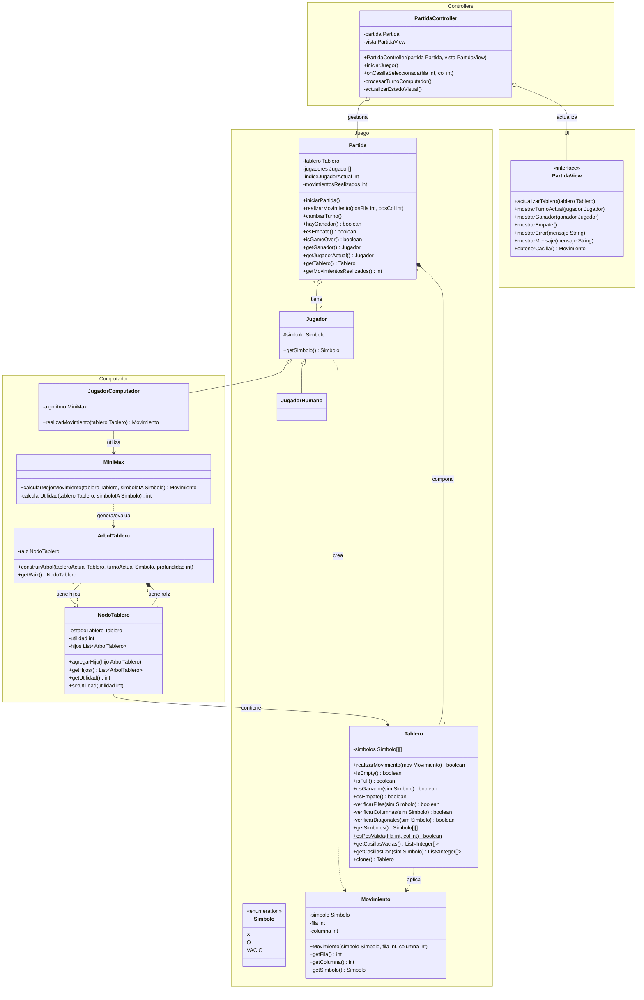

# TicTacToe_ED - Tres en Raya Inteligente

Proyecto para la asignatura de **Estructuras de Datos (ESPOL)**. Consiste en la implementación de un sistema interactivo del clásico juego **Tres en Raya (Tic-Tac-Toe)** equipado con Inteligencia Artificial basada en el algoritmo **Minimax** y estructuras de datos no lineales hechas a medida.

---

## Descripción del Proyecto

El objetivo principal de esta aplicación es ofrecer una experiencia de juego interactiva mediante una interfaz gráfica que permite poner a prueba estrategias humanas contra decisiones óptimas calculadas por la computadora. 

A diferencia de aproximaciones convencionales, la toma de decisiones de la computadora no es aleatoria ni basada en reglas fijas (*hardcoded*); en su lugar, se construye dinámicamente un **Árbol $N$-ario de Estados del Tablero** que evalúa las jugadas a dos turnos hacia el futuro mediante la función de utilidad:

$$U_{\text{jugador}}(t) = P_{\text{jugador}} - P_{\text{oponente}}$$

Donde $P$ representa el número de líneas (filas, columnas y diagonales) aún disponibles para ganar en un estado específico del tablero.

---

##  Características y Modos de Juego

###  Modos Disponibles
* **Humano vs. Computador (HvsC):** El modo principal donde un usuario desafía a la IA.
* **Humano vs. Humano (HvsH):** Dos jugadores locales compiten en la misma interfaz.
* **Computador vs. Computador (CvsC):** Simulación automatizada de partida entre dos instancias del algoritmo Minimax.

###  Configuración Previa
* **Selección de Símbolo:** Asignación libre de fichas (`X` u `O`) para cada jugador.
* **Selección de Turno Inicial:** Elección de quién realiza el primer movimiento de la partida.
* **Detección Automática:** Verificación en tiempo real de victoria, derrota o empate.

---

##  Funcionalidades Opcionales / Extras

El sistema está diseñado modularmente para soportar las siguientes capacidades avanzadas:

- [ ] ** Recomendador de Jugadas:** Asistente integrado que sugiere al jugador humano la casilla óptima a marcar analizando el estado del árbol.
- [ ] ** Depurador de Utilidad en Tiempo Real:** Panel gráfico que muestra las jugadas candidatas evaluadas por la IA junto con sus valores de utilidad calculados ($u_{\min}$ y $u_{\max}$).
- [ ] ** Inspector Visual del Árbol de Decisiones:** Renderizado gráfico interactivo de la estructura jerárquica del árbol $N$-ario generado durante el turno de la computadora.
- [ ] ** Persistencia de Partidas:** Opciones para guardar el estado actual de una partida en disco y reanudarla posteriormente.

---

##  Arquitectura del Sistema (Diagrama de Clases)

El proyecto adopta los principios de diseño orientado a objetos dividiendo la lógica en dos módulos principales: **Juego** y **Computador**.

###  Descripción de Componentes Principales

* **`Tablero`:** Representación matricial $3 \times 3$ del estado de la partida. Incluye lógica propia para clonación profunda (`copy()`) e inspección de estados.
* **`Jugador` (Abstracción):** Define el contrato polimórfico mediante el cual la `Partida` solicita movimientos sin importar si el actor es un humano o un algoritmo.
* **`ArbolTablero` / `NodoTablero`:** Implementación propia de una estructura de datos **Árbol $N$-ario**, donde cada nodo alberga una copia aislada del tablero y la lista de ramificaciones hipotéticas hacia el futuro.
* **`MiniMax`:** Motor de decisión encargada de recorrer el árbol $N$-ario, calcular utilidades y maximizar las ganancias mínimas de la máquina.

---

##  Tecnologías Utilizadas

* **Lenguaje:** Java 11+
* **Interfaz Gráfica:** JavaFX / Android Studio
* **Entorno de Desarrollo:** NetBeans / IntelliJ IDEA / Android Studio
* **Estructuras de Datos:** 
  * Árbol $N$-ario (Implementación nativa/propia)
  * Colecciones lineales (`List`, `ArrayList` del *Java Collection Framework*)
  * Matrices bidimensionales